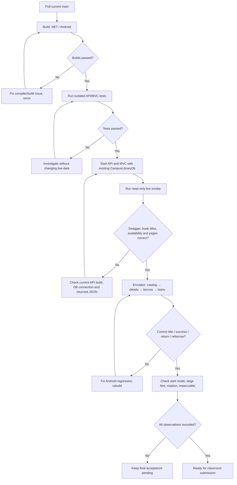
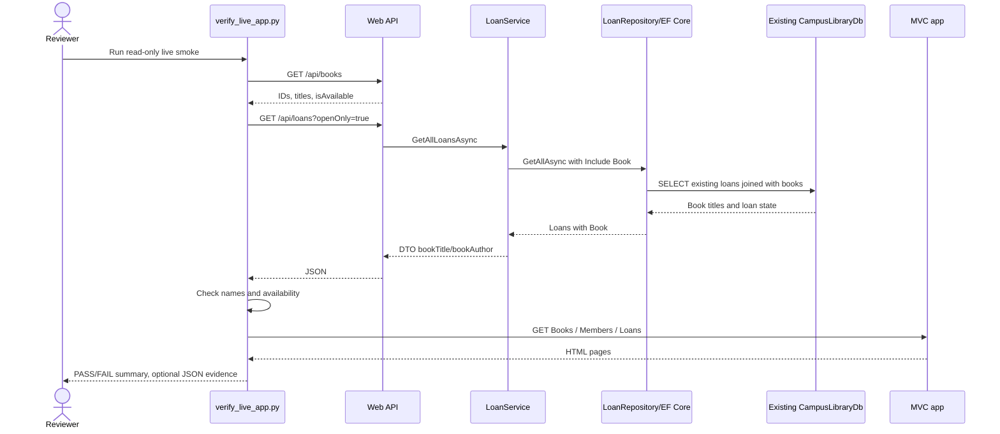

# Final verification flows

## Safe verification logic

```mermaid
flowchart TD
    A[Pull current main] --> B[Build .NET / Android]
    B --> C{Builds passed?}
    C -->|No| D[Fix compiler/build issue; rerun]
    D --> B
    C -->|Yes| E[Run isolated API/MVC tests]
    E --> F{Tests passed?}
    F -->|No| G[Investigate without changing live data]
    G --> E
    F -->|Yes| H[Start API and MVC with existing CampusLibraryDb]
    H --> I[Run read-only live smoke]
    I --> J{Swagger, book titles, availability and pages correct?}
    J -->|No| K[Check current API build, DB connection and returned JSON]
    K --> H
    J -->|Yes| L[Emulator: catalog → details → borrow → loans]
    L --> M{Correct title / success / return / reborrow?}
    M -->|No| N[Fix Android regression; rebuild]
    N --> L
    M -->|Yes| O[Check dark mode, large font, rotation, Impeccable]
    O --> P{All observations recorded?}
    P -->|No| Q[Keep final acceptance pending]
    P -->|Yes| R[Ready for classroom submission]
```

## Read-only source-to-screen sequence

```mermaid
sequenceDiagram
    actor Reviewer
    participant Python as verify_live_app.py
    participant API as Web API
    participant S as LoanService
    participant R as LoanRepository/EF Core
    participant DB as Existing CampusLibraryDb
    participant MVC as MVC app
    Reviewer->>Python: Run read-only live smoke
    Python->>API: GET /api/books
    API-->>Python: IDs, titles, isAvailable
    Python->>API: GET /api/loans?openOnly=true
    API->>S: GetAllLoansAsync
    S->>R: GetAllAsync with Include Book
    R->>DB: SELECT existing loans joined with books
    DB-->>R: Book titles and loan state
    R-->>S: Loans with Book
    S-->>API: DTO bookTitle/bookAuthor
    API-->>Python: JSON
    Python->>Python: Check names and availability
    Python->>MVC: GET Books / Members / Loans
    MVC-->>Python: HTML pages
    Python-->>Reviewer: PASS/FAIL summary, optional JSON evidence
```

No database or schema mutations are part of this verification. No new ERD is required.
